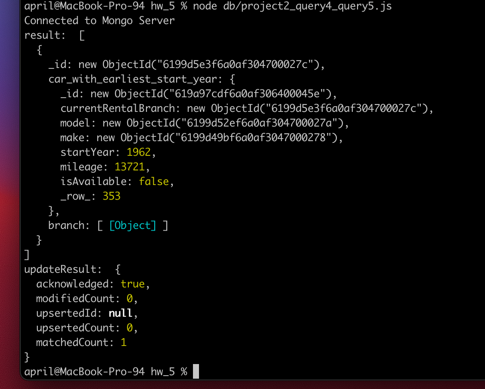
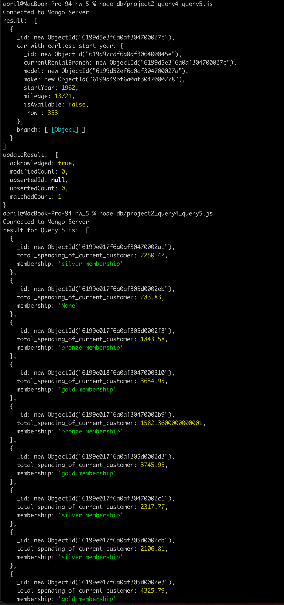

# Building an management system for a car rental company
## Purpose Statement
We aim to develop a web-based management system for a car rental company. It has two main functionalities: 
1. Facilitate the rental company to manage their car fleet. For example: the rental company can add a new car to their fleet, update a car's rental price and other information, or delete an existing car from the fleet. 
2. Provide a powerful tool for the rental company to monitor their business activities in all aspects. For example: the system can display all the cars owned by the rental company, fleets at different locations, amount of transactions per month, number of customers etc. By closely monitoring their business data, the rental company can adjust business strategies based on performance as well as gain a better understanding of their customers in order to promote the quality of service. 

## How to run the program
1. clone the project to your local using git clone.
2. cd into project directory.
3. populate the MongoDB database using instructions below.
4. run npm install command to install all necessary packages.
5. run npm start command.
6. open your browser and navigate to localhost:3000/ and you should see the "Car Management" page.

## UML Diagram
https://lucid.app/lucidchart/722ed355-65d1-47df-9cc8-3ba5faa57deb/edit?beaconFlowId=341BAFE5E164E51C&invitationId=inv_6ba983b6-83d2-4e74-866d-5fbff519bbd8&page=0_0#


## ERD Diagram
https://lucid.app/lucidchart/4cc47107-7d20-475b-9944-03504518d9ac/edit?page=0_0&invitationId=inv_9cbd9f0a-f83d-4c95-931b-c6932ece15a2#


## Business requirement 
Please see file: Project_docs/businessRequirement.pdf

## How to populate the MongoDB database
1. Please find the file "Project2.zip" file under the project directory.  
2. Download the zip file into your local (e.g. your desktop) and unzip it.  
3. Then, assume you've installed the mongod server, mongosh shell and the MongoDB Database Tools in your local, you can start a MongoDB instance in your local by using command ```brew services start mongodb-community@5.0``` Please refer to the documentation here for running mongod server on macOS system (https://docs.mongodb.com/manual/tutorial/install-mongodb-on-os-x/).  
4. Once you have the mongod server running, run the command ```mongorestore -d project2 ~/Desktop/project2``` (change the path to the <strong>unzipped file</strong> as needed). Open your MongoDB Compass application, connect to localhost:27017 and you should see a new database called project2 has been created and there're 6 collections in it (see sample picture below).  


## 5 queries we wrote for the database
Files for the queries: Project_docs/queries
Screenshots of the run results of these 5 queries  
  
query 1    


  

query 2  

  

query 3  

  

query 4  

  
query 5  


## Mongo Collections and sample JSON

We’ll have 6 collections -- Car, Customer, Booking, RentalBranch, CarModel, CarMake. We choose to use references to store the relationship between data, like the example JSONs below.

JSON examples
<pre>
Car collection:  
{  
    “_id”: ObjectId(“fdasfdsr34rqfdtewf”),  
    “currentRentalBranch”: ObjectId(“123123”),  
    “model”:  ObjectId(“234234”),  
    “make”: ObjectId(“456456”),  
    “startYear”: 2020,  
    “mileage”: 19898， 
    “isAvailable”: true  
}  
  
Customer collection:  
{  
    “_id”: ObjectId(“fdasfdsafdsaf”),  
    “firstName”: “April”,  
    “lastName”: “Zhang”,  
    “phoneNumber”: “8883507088”,  
    “email”: “email@my.com”,  
    “city”: “Sunnyvale”,  
    “state”: “California”,  
    “country”: “USA”  
}  
  
Booking collection:  
{  
    “_id”: ObjectId(“fdsrewrgfds”),  
    “bookingStartDate”: 2021-08-09T09:55:47.000+00:00,  
    “bookingEndDate”: 2021-09-19T09:55:47.000+00:00,  
    “car”: ObjectId(“432432rdwar”),  
    “customer”: ObjectId(“54f345”),  
    “totalCharge”: 56.78,  
    “pickupRentalBranch”: ObjectId(“fda324fdsafdsa”),  
    “returnRentalBranch”: ObjectId(“432432fdsafdsfds”)  
}  
  
RentalBranch collection:  
{  
    "_id"：ObjectId(“123123”),  
    "branchName": “5th Avenue”,  
    "address": “5th Avenue”,  
    "city": “San Jose”,  
    "state":  “California”,  
    "country" : “United States”,  
    "branchManager": “Tim Cook”  
}  

CarMake collection:  
{  
    “_id”：ObjectId(“456456”),  
    “make”：”Honda”,  
}  
  
CarModel collection:  
{  
    “_id”: ObjectId(“543543”),  
    “model”: “Elantra”  
}  
</pre>  
## Team contributions
We splitted our tasks evenly during this assignment. We conducted zoom meetings/online chat/Lucid Chart to put together the business requirement documents, UML and ERD diagrams.  
For creating testing data and populating the database, April and Bugu discussed and agreed on the data format. April created mock data using Mockaroo and Bugu tried importing the data and QA'ed the data for April.  
For creating the 5 MongoDB queries, April wrote and ran query 4 and 5. Bugu wrote and ran query 1, 2 and 3.  
We set up the Github repo together and both worked on uploading files into the repo as well as the write-up for this README.md file

In terms of project implementation, the work is splitted as below:  
  
@Bugu Wu implemented:
1. CRUD operations of Rental Branch  
2. Implemented rental branch search:  
   a. Filter top K rental ranches based on their transaction amount   
4. Implemented booking analysis:  
   a. Filter bookings by start/end date  
   b. Filter bookings by car make/category
         
@April Zhang implemented:
1. CRUD operations of Car  
2. Implemented car search functionalities:  
   a. Filter cars by service start year  
   b. Filter cars that belong to a certain make and model  
3. Implemented Customer analysis:  
   a. calculate customers' membership titles based on their total transaction amount.  
   b. search and display customers that have booked with the company for more than certain times.
