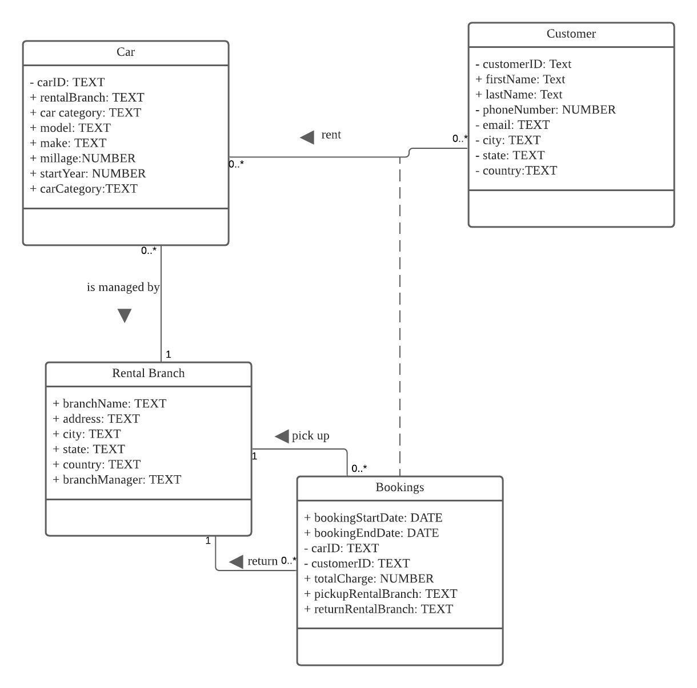
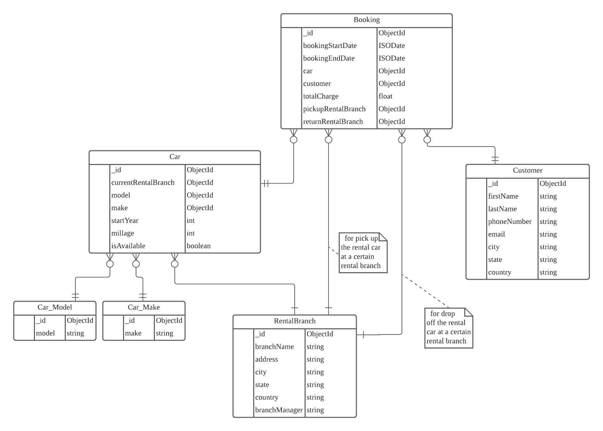
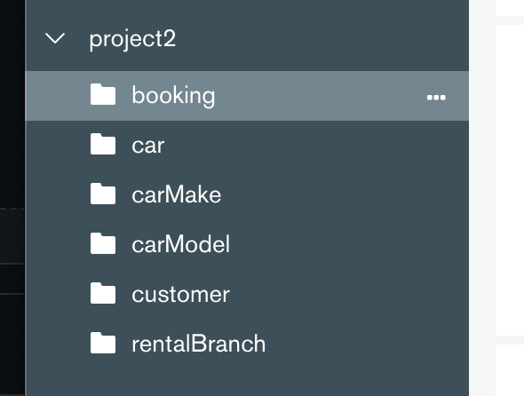

# Building an management system for a car rental company
## Purpose Statement
We aim to develop a web-based management system for a car rental company. It has two main functionalities: 
1. Facilitate the rental company to manage their car fleet. For example: the rental company can add a new car to their fleet, update a car's rental price and other information, or delete an existing car from the fleet. 
2. Provide a powerful tool for the rental company to monitor their business activities in all aspects. For example: the system can display all the cars owned by the rental company, fleets at different locations, amount of transactions per month, number of customers etc. By closely monitoring their business data, the rental company can adjust business strategies based on performance as well as gain a better understanding of their customers in order to promote the quality of service. 

## How to run the program
1. clone the project to your local using git clone.
2. cd into project directory.
3. populate the MongoDB database using instructions below.
4. run ```npm install``` command to install all necessary packages.
5. cd into the project directory, run the command ```node loadData.js``` (assuming you have Redis set up in your local) and this will populate your local Redis database with the data structures that you'll need to run the application. loadData.js contains the script to import data from the MongoDB database and export them into the Redis database. Proceed to the next step only if this step has been successfully completed. 
6. run npm start command.
7. open your browser and navigate to localhost:3000/ and you should see the "Car Management" page.

## UML Diagram
https://lucid.app/lucidchart/722ed355-65d1-47df-9cc8-3ba5faa57deb/edit?beaconFlowId=341BAFE5E164E51C&invitationId=inv_6ba983b6-83d2-4e74-866d-5fbff519bbd8&page=0_0#



## ERD Diagram
https://lucid.app/lucidchart/4cc47107-7d20-475b-9944-03504518d9ac/edit?page=0_0&invitationId=inv_9cbd9f0a-f83d-4c95-931b-c6932ece15a2#



## Business requirement 
Please see file: Project_docs/businessRequirement.pdf

## How to populate the MongoDB database
1. Please find the file "Project2.zip" file under the project directory.  
2. Download the zip file into your local (e.g. your desktop) and unzip it.  
3. Then, assume you've installed the mongod server, mongosh shell and the MongoDB Database Tools in your local, you can start a MongoDB instance in your local by using command ```brew services start mongodb-community@5.0``` Please refer to the documentation here for running mongod server on macOS system (https://docs.mongodb.com/manual/tutorial/install-mongodb-on-os-x/).  
4. Once you have the mongod server running, run the command ```mongorestore -d project2 ~/Desktop/project2``` (change the path to the <strong>unzipped file</strong> as needed). Open your MongoDB Compass application, connect to localhost:27017 and you should see a new database called project2 has been created and there're 6 collections in it (see sample picture below).  


## Redis data structured used in this project
Multiple Redis data structures are used for this project. We have chosen to implement the CRUD of the cars, search of the customers entirely using the Redis database and structures. A detailed walkthrough of the Redis data structures used in this project is explained below. 

1. Each car, customer, booking has their own hashes. 

For car, the key is in the format of car:carID
Sample car hash
<pre>
id: 619a97cef6a0af30a000046a,
startYear: 2006,
model: Metro,
make: Isuzu,
currentRentalBranch: Sonair,
isAvailable: 1,
milage: 18730
</pre>  

For customer, the key is in the format of customer:customerID
Sample customer hash
<pre>
id: 6199e017f6a0af305d0002c4,
firstName: Caprice,
lastName: Tebbut,
phoneNumber: 626-397-8896,
email: ctebbuty@mail.ru,
city: Alhambra,
state: California,
country: United States
</pre> 

For booking, the key is in the format of booking:bookingID
Sample booking hash
<pre>
bookingStartDate: Wed Sep 26 2018 03:47:10 GMT-0700 (Pacific Daylight Time),
bookingEndDate: Wed Nov 14 2018 02:47:10 GMT-0800 (Pacific Standard Time),
totalCharge: 891.17,
pickupRentalBranch: Holdlamis,
returnRentalBranch: Holdlamis
</pre> 

2. All the cars and customers keys are put into 2 separate lists (with the key "allCars" and "allCustomers"), so that we can render all the cars/customers relatively easy. We just need to iterate over the set and retrieve the individual hashes using the keys. Also, since lists are ordered, the order of car/customer display won't change when we refresh. 

3. Each customer's bookings' keys are put in sets, so that when we render customer details we can retrieve their booking history very fast. The keys of these sets are in the format of "customer:customerID:bookings". 

Sample booking history set with the key "customer:6199e017f6a0af30470002b4:bookings"
<pre>
booking:619adf96f6a0af308e0004b7,
booking:619adf96f6a0af30a00004ad,
booking:619adf96f6a0af30a300048b
</pre> 

4. There's also a search functionality in the customer page. For this, I have additional sets set up that contain the customers who have booked with the company larger than X times. 
The keys of these sets are in the format of "bookingTimes:X"

Sample set with the key "bookingTimes:7" (this set contains the keys of the customers who have booked with the company for exactly 7 times)
<pre>
customer:6199e018f6a0af304700030f,
customer:6199e017f6a0af305d0002f2,
customer:6199e017f6a0af30470002d6,
customer:6199e017f6a0af305d0002da,
customer:6199e018f6a0af305d0002fa,
customer:6199e017f6a0af305d0002d4
</pre>

to faciliate this functionality, I also have a string data structure set up to record what is the maximum number of bookings any customer has with the company
key: "maximumTimes", value: "7"

## Team contributions
We splitted our tasks evenly during this assignment. We conducted zoom meetings/online chat/Lucid Chart to put together the business requirement documents, UML and ERD diagrams.  
For creating testing data and populating the database, April and Bugu discussed and agreed on the data format. April created mock data using Mockaroo and Bugu tried importing the data and QA'ed the data for April.  
For creating the 5 MongoDB queries, April wrote and ran query 4 and 5. Bugu wrote and ran query 1, 2 and 3.  
We set up the Github repo together and both worked on uploading files into the repo as well as the write-up for this README.md file

In terms of project implementation, the work is splitted as below:  
  
@Bugu Wu implemented:
1. CRUD operations of Rental Branch
2. Implement latest edited branch 

         
@April Zhang implemented:
1. Wrote the script that import data from MongoDB to Redis in appropriate data structures
2. CRUD operations of Car  
3. Implemented Customer analysis:  
   b. search and display customers that have booked with the company for more than certain times.
